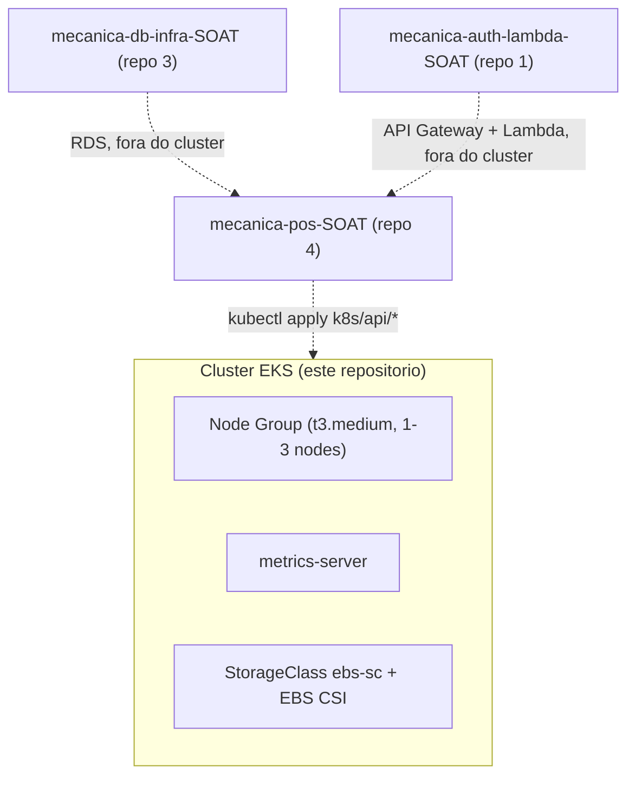

# Castor Garage - K8s Infra (EKS)

Terraform do cluster Kubernetes do Tech Challenge Fase 3 (SOAT). Repositório
2 dos 4 exigidos pela entrega ("Infraestrutura Kubernetes (Terraform)").

## Propósito

Provisiona **só o cluster** — a "infraestrutura vazia" onde a aplicação
principal roda. Não contém código de aplicação nem manifestos da API: isso
fica em [`mecanica-pos-SOAT`](https://github.com/Castor-Garage/mecanica-pos-SOAT)
(`k8s/api/*`), que publica a API dentro do cluster que este repositório
já deixa no ar, via seu próprio pipeline de CI/CD.

Este módulo é a continuação direta do que a Fase 2 já tinha em
`mecanica-pos-SOAT/infra/aws`, agora em repositório próprio e **sem** o
banco de dados em cluster — o Postgres passou a ser um RDS gerenciado,
provisionado em [`mecanica-db-infra-SOAT`](https://github.com/Castor-Garage/mecanica-db-infra-SOAT)
(repositório 3).

## O que é provisionado

1. **Cluster EKS + node group**, reaproveitando o `LabRole` da AWS Academy
   como cluster role e node role (a Academy não permite criar IAM roles
   novas).
2. **Tags de descoberta de subnet** (`kubernetes.io/cluster/<nome>` e
   `kubernetes.io/role/elb`) nas subnets da VPC default — sem elas o
   Service `LoadBalancer` da API (`mecanica-pos-SOAT/k8s/api/service.yaml`)
   fica preso em "pending".
3. **metrics-server** — necessário para o HPA
   (`mecanica-pos-SOAT/k8s/api/hpa.yaml`) conseguir ler uso de CPU/memória
   e escalar.
4. **StorageClass `ebs-sc` (gp3) + addon EBS CSI driver** — o EKS não vem
   com StorageClass padrão nem driver de disco instalado.

**Não é feito aqui** (de propósito): deploy da API (job `deploy` do
pipeline de `mecanica-pos-SOAT`) e provisionamento do banco de dados
(`mecanica-db-infra-SOAT`).

## Pré-requisitos

- Sessão ativa do [AWS Academy Learner Lab](https://awsacademy.instructure.com/)
  (**Start Lab**, credenciais temporárias exportadas).
- [AWS CLI](https://docs.aws.amazon.com/cli/latest/userguide/getting-started-install.html)
- [kubectl](https://kubernetes.io/docs/tasks/tools/#kubectl)
- [Terraform](https://developer.hashicorp.com/terraform/install) >= 1.5

## Uso

```bash
export AWS_ACCESS_KEY_ID=...
export AWS_SECRET_ACCESS_KEY=...
export AWS_SESSION_TOKEN=...
export AWS_REGION=us-east-1

terraform init
terraform apply -var="lab_role_arn=arn:aws:iam::<account-id>:role/LabRole"
```

Ao final, o cluster `castor-garage` está no ar. Para apontar o `kubectl`
local pra ele:

```bash
terraform output -raw update_kubeconfig_command | bash
kubectl --context castor-garage get nodes
```

## Por que o cluster não é criado/destruído a cada push

Criar e destruir um cluster EKS leva de 15 a 25 minutos em cada sentido —
fazer isso a cada execução da pipeline seria lento e gastaria à toa o
tempo/orçamento limitado do Learner Lab. O fluxo aqui é:

1. `terraform apply` roda **uma vez**, manualmente ou pelo pipeline,
   deixando o cluster no ar.
2. O pipeline de `mecanica-pos-SOAT` só publica a nova imagem da API no
   cluster já existente, a cada push em `main`/`develop` (sem recriar
   nada aqui).
3. Quando terminar de usar (ex.: depois de gravar o vídeo demonstrativo),
   rode `terraform destroy` pra não deixar recursos cobrando na conta do
   Lab.

## CI/CD (`.github/workflows/pipeline.yml`)

- **PR**: `terraform fmt -check`, `validate`, `plan`.
- **push em `main`**: `terraform apply -auto-approve`.

Secrets do repositório (Settings → Secrets and variables → Actions):

| Secret | Valor |
|---|---|
| `AWS_ACCESS_KEY_ID` | sessão temporária do AWS Academy |
| `AWS_SECRET_ACCESS_KEY` | sessão temporária do AWS Academy |
| `AWS_SESSION_TOKEN` | sessão temporária do AWS Academy |
| `LAB_ROLE_ARN` | `arn:aws:iam::<account-id>:role/LabRole` |

Como as credenciais do Academy são temporárias (expiram em poucas horas),
**atualize os 3 primeiros secrets toda vez que reiniciar a sessão do Lab**,
antes de dar push ou rodar a pipeline de novo. O primeiro `apply` é lento
(criação do cluster) — considere rodá-lo manualmente na primeira vez, pra
não perder a execução no meio por expiração de sessão.

## Destruir

```bash
terraform destroy -var="lab_role_arn=arn:aws:iam::<account-id>:role/LabRole"
```

## Risco conhecido

Reaproveitar o `LabRole` como cluster role e node role do EKS só funciona
se a trust policy do `LabRole` permitir ser assumido pelos serviços
`eks.amazonaws.com` e `ec2.amazonaws.com` — isso varia conforme a
configuração do curso na Academy e não pode ser alterado (não é possível
editar a trust policy do `LabRole`). Se o `terraform apply` travar na
criação do `aws_eks_cluster` por erro de permissão/trust policy, esse é o
motivo — nesse caso a alternativa é provisionar um EC2 com `k3s` no lugar
do EKS.

## Diagrama


